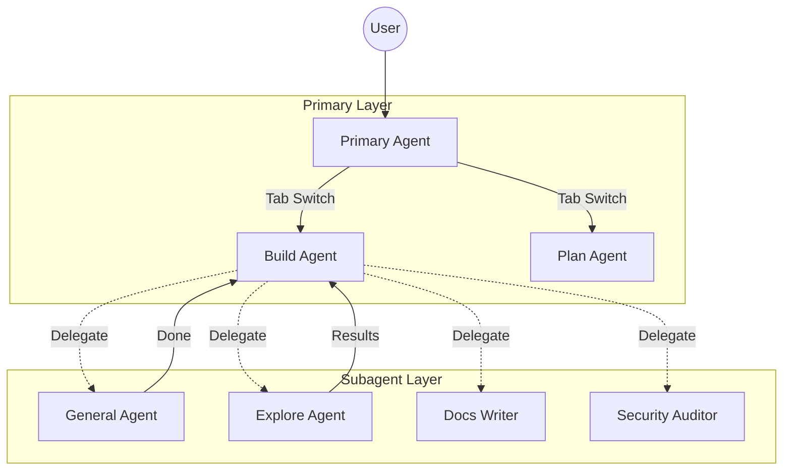

# OpenCode

The open source AI coding agent

<div class="pt-12 flex justify-center gap-4 text-lg">
  <span class="px-2 py-1 rounded bg-white/10">
    <carbon:star class="inline mr-1"/> 80K+ Stars
  </span>
  <span class="px-2 py-1 rounded bg-white/10">
    <carbon:user class="inline mr-1"/> 1.5M Developers
  </span>
  <span class="px-2 py-1 rounded bg-white/10">
    <carbon:cloud class="inline mr-1"/> 75+ Providers
  </span>
</div>

<div class="abs-br m-6 flex gap-2">
  <a href="https://github.com/anomalyco/opencode" target="_blank" class="text-xl icon-btn opacity-50 hover:text-white">
    <carbon-logo-github />
  </a>
</div>

---
layout: default
---

# 今日议程

<div class="grid grid-cols-2 gap-10 pt-4">

<div>

- **核心洞察**
  为什么 CLI Agent 正在超越 AI IDE
- **架构解析**
  Subagent 专家团队体系
- **护城河**
  Skill 与 Plugin 扩展系统

</div>

<div>

- **实战对比**
  OpenCode vs Claude Code
- **生态增强**
  oh-my-opencode
- **未来展望**
  Agentic Coding 的终局

</div>

</div>

---

# 什么是 OpenCode?

<div class="grid grid-cols-2 gap-8 mt-8">

<div>

OpenCode 是一个**开源 AI 编码代理**，帮助你在终端、IDE 或桌面应用中编写代码。

<div class="mt-6 space-y-3">
  <div class="flex items-center gap-2">
    <carbon:terminal class="text-green-400"/> <span><b>终端界面</b> - 原生 CLI 体验</span>
  </div>
  <div class="flex items-center gap-2">
    <carbon:application class="text-blue-400"/> <span><b>桌面应用</b> - macOS, Windows, Linux</span>
  </div>
  <div class="flex items-center gap-2">
    <carbon:code class="text-purple-400"/> <span><b>IDE 扩展</b> - VS Code 等编辑器</span>
  </div>
</div>

</div>

<div class="text-sm">

```bash
# 一键安装
curl -fsSL https://opencode.ai/install | bash

# 或通过包管理器
npm install -g opencode-ai
brew install opencode
```

<div class="mt-4 p-3 rounded bg-blue-500/10 border border-blue-500/20">
  <carbon:idea class="text-blue-400 inline mr-2"/>
  <span class="text-blue-300">由 SST (Serverless Stack) 团队打造</span>
</div>

</div>

</div>

---
layout: two-cols
layoutClass: gap-8
---

# 核心特性一览

<v-clicks>

- **LSP 集成**
  自动加载正确的语言服务器
  
- **多会话支持**
  同一项目并行启动多个 Agent
  
- **会话分享**
  生成链接分享调试上下文
  
- **隐私优先**
  不存储任何代码或上下文数据

</v-clicks>

::right::

<div class="mt-10">

<v-clicks>

- **GitHub Copilot 集成**
  直接使用 Copilot 账号登录
  
- **ChatGPT Plus/Pro**
  使用 OpenAI 订阅账号
  
- **75+ 模型提供商**
  通过 Models.dev 接入，含本地模型
  
- **完全开源**
  MIT 协议，600+ 贡献者

</v-clicks>

</div>

---
layout: two-cols
layoutClass: gap-8
---

# AI IDE (Cursor)

**受限的沙箱环境**

- **权限受限**
  运行在沙箱中，无法触达系统
  
- **平台锁定**
  难以集成第三方工具链
  
- **黑盒状态**
  思考过程不可见，难以调试
  
- **订阅模式**
  按月付费，无法自托管

::right::

# CLI Agent (OpenCode)

**完整的系统掌控**

- **User-level 权限**
  直接调用所有系统命令
  
- **无限扩展**
  Plugin/Skill 连接任意 API
  
- **透明可控**
  完整的思考日志与会话分享
  
- **灵活计费**
  按量付费或使用免费模型

<br>

> **核心差异**
> IDE 试图把 AI 关进笼子，CLI 赋予 AI 自由。

---

# Subagent：专家团队架构

OpenCode 不仅仅是一个聊天机器人，它是一个**组织架构**。



<div class="grid grid-cols-3 gap-4 mt-4 text-center">
  <div>🎯 <b>任务分解</b></div>
  <div>🚀 <b>并行执行</b></div>
  <div>🧠 <b>模型专精</b></div>
</div>

---
layout: two-cols
---

# Skill 系统：知识固化

IDE 的 Prompt 是临时的<br>
OpenCode 的 **Skill 是资产**

> 将团队的最佳实践编码为可复用的 Skill

<div class="mt-6">

**Skill 的三大优势：**

1. **可版本控制** - 随代码库演进
2. **可共享复用** - 团队知识沉淀
3. **精准触发** - 自动匹配场景

</div>

::right::

```yaml {all|2-3|6-9|11-12}
# .opencode/skills/api-design/SKILL.md
name: api-design
description: Design RESTful APIs following standards

## 我负责什么
- 设计符合 OpenAPI 3.0 规范的接口
- 强制使用 Snake Case 命名数据库字段
- 自动生成 Zod Schema 验证

## 何时使用我
当用户要求"创建新接口"或"设计数据库"时
```

---

# Plugin 系统：生命周期挂钩

OpenCode 提供了 **25+ 生命周期钩子**，这是 IDE 插件无法比拟的。

```typescript {all|4-10|12-16}
// .opencode/plugins/security-guard.ts
export const SecurityGuard = async ({ project, client, $ }) => {
  return {
    // 在工具执行前拦截
    "tool.execute.before": async (input, output) => {
      // 禁止非授权 Agent 读取 .env
      if (input.tool === "read" && output.args.filePath.includes(".env")) {
        throw new Error("Security Alert: .env access denied!")
      }
    },
    
    // 任务完成通知
    event: async ({ event }) => {
      if (event.type === "session.idle") {
        await $`osascript -e 'display notification "任务完成!"'`
      }
    }
  }
}
```

---

# 模型生态：自由选择

<div class="grid grid-cols-3 gap-6 mt-8">

<div class="p-4 rounded-lg bg-gradient-to-br from-purple-500/20 to-blue-500/20 border border-purple-500/30">
  <div class="text-2xl mb-2">🤖</div>
  <div class="font-bold text-purple-300">Anthropic</div>
  <div class="text-sm opacity-70 mt-1">Claude 3.5/4 Sonnet, Opus</div>
</div>

<div class="p-4 rounded-lg bg-gradient-to-br from-green-500/20 to-teal-500/20 border border-green-500/30">
  <div class="text-2xl mb-2">🧠</div>
  <div class="font-bold text-green-300">OpenAI</div>
  <div class="text-sm opacity-70 mt-1">GPT-4o, o1, o3</div>
</div>

<div class="p-4 rounded-lg bg-gradient-to-br from-blue-500/20 to-cyan-500/20 border border-blue-500/30">
  <div class="text-2xl mb-2">💎</div>
  <div class="font-bold text-blue-300">Google</div>
  <div class="text-sm opacity-70 mt-1">Gemini 2.0 Flash/Pro</div>
</div>

<div class="p-4 rounded-lg bg-gradient-to-br from-orange-500/20 to-red-500/20 border border-orange-500/30">
  <div class="text-2xl mb-2">🔥</div>
  <div class="font-bold text-orange-300">DeepSeek</div>
  <div class="text-sm opacity-70 mt-1">V3, R1 (免费/低成本)</div>
</div>

<div class="p-4 rounded-lg bg-gradient-to-br from-gray-500/20 to-slate-500/20 border border-gray-500/30">
  <div class="text-2xl mb-2">🏠</div>
  <div class="font-bold text-gray-300">本地模型</div>
  <div class="text-sm opacity-70 mt-1">Ollama, LM Studio</div>
</div>

<div class="p-4 rounded-lg bg-gradient-to-br from-yellow-500/20 to-amber-500/20 border border-yellow-500/30">
  <div class="text-2xl mb-2">🔌</div>
  <div class="font-bold text-yellow-300">GitHub Copilot</div>
  <div class="text-sm opacity-70 mt-1">使用已有订阅</div>
</div>

</div>

<div class="mt-6 text-center text-sm opacity-70">
  通过 <span class="text-blue-400">Models.dev</span> 统一接入 75+ 模型提供商
</div>

---

# 体验报告：超越 Claude Code

| 维度 | OpenCode | Claude Code |
| :--- | :--- | :--- |
| **模型选择** | **75+ 模型** (含免费模型) | 仅 Anthropic |
| **运行环境** | 终端 / 桌面 / IDE | 仅终端 |
| **GitHub Copilot** | ✅ 可直接使用 | ❌ 不支持 |
| **账号安全** | **无风险** (API Key) | 有封号风险 |
| **可扩展性** | **Skill + Plugin 系统** | 仅配置修改 |
| **成本控制** | **按量 / 免费模型** | 订阅制 ($20/mo+) |
| **开源协议** | **MIT 开源** | 闭源 |

<br>

<div class="text-center text-blue-400 font-bold">
  OpenCode = Claude Code 的体验 + 开源的自由 + 无限的扩展
</div>

---
layout: center
class: text-center
---

# oh-my-opencode

社区驱动的增强包，让 OpenCode 进化为完全体。

<div class="grid grid-cols-2 gap-x-12 gap-y-8 text-left mt-8">

<div>
  <div class="text-purple-400 font-bold">🔮 Oracle Agent</div>
  <div class="text-sm opacity-80">高智商架构师，负责复杂逻辑推理与架构设计</div>
</div>

<div>
  <div class="text-blue-400 font-bold">📚 Librarian Agent</div>
  <div class="text-sm opacity-80">文档专家，自动检索外部库文档与示例</div>
</div>

<div>
  <div class="text-yellow-400 font-bold">🔭 Explore Agent</div>
  <div class="text-sm opacity-80">代码库探索者，基于 AST 深度理解项目结构</div>
</div>

<div>
  <div class="text-green-400 font-bold">🔄 Ultrawork Loop</div>
  <div class="text-sm opacity-80">无人值守开发闭环，自动迭代直到完成</div>
</div>

<div>
  <div class="text-red-400 font-bold">🎯 Prometheus Plan</div>
  <div class="text-sm opacity-80">智能规划器，复杂任务自动拆解编排</div>
</div>

<div>
  <div class="text-cyan-400 font-bold">🔍 Code Reviewer</div>
  <div class="text-sm opacity-80">代码审查员，发现潜在问题与优化建议</div>
</div>

</div>

---

# 隐私与企业级安全

<div class="grid grid-cols-2 gap-8 mt-8">

<div>

### 隐私优先设计

- **零数据存储**
  OpenCode 不存储任何代码或上下文
  
- **本地模型支持**
  敏感项目可完全离线运行
  
- **自托管选项**
  企业可部署私有实例

</div>

<div>

### Zen 订阅服务

为追求稳定性的团队提供：

- **经过验证的模型**
  专门针对编码任务测试优化
  
- **一致的性能**
  无需担心不同提供商的差异
  
- **企业级支持**
  专业团队保障服务质量

</div>

</div>

<div class="mt-8 p-4 rounded-lg bg-green-500/10 border border-green-500/30 text-center">
  <carbon:security class="text-green-400 inline mr-2"/>
  <span>适用于金融、医疗、政府等隐私敏感环境</span>
</div>

---
layout: center
class: text-center
---

# Agentic Coding 的未来

从 **Copilot (副驾驶)** 到 **Autopilot (自动驾驶)**

<div class="flex justify-center gap-12 mt-12 text-left">

<div>
  <div class="text-4xl mb-2">💻</div>
  <div class="font-bold">终端回归</div>
  <div class="text-xs opacity-70">CLI 是最高效的系统接口</div>
</div>

<div>
  <div class="text-4xl mb-2">🔌</div>
  <div class="font-bold">MCP 标准化</div>
  <div class="text-xs opacity-70">Model Context Protocol 连接万物</div>
</div>

<div>
  <div class="text-4xl mb-2">🛒</div>
  <div class="font-bold">Skill 市场</div>
  <div class="text-xs opacity-70">复用全球开发者的智慧</div>
</div>

<div>
  <div class="text-4xl mb-2">🤝</div>
  <div class="font-bold">多 Agent 协作</div>
  <div class="text-xs opacity-70">专家团队并行工作</div>
</div>

</div>

---

# 快速上手

<div class="grid grid-cols-2 gap-8">

<div>

### 1. 安装 OpenCode

```bash
# macOS / Linux
curl -fsSL https://opencode.ai/install | bash

# 或使用包管理器
npm install -g opencode-ai
brew install opencode
```

### 2. 配置模型

```bash
# 使用 GitHub Copilot
opencode auth login github

# 或设置 API Key
export ANTHROPIC_API_KEY=sk-xxx
```

</div>

<div>

### 3. 开始使用

```bash
# 在项目目录启动
cd your-project
opencode

# 或带上初始提示
opencode "帮我重构这个函数"
```

### 4. 探索更多

- 📖 文档: [opencode.ai/docs](https://opencode.ai/docs)
- 💬 Discord: [opencode.ai/discord](https://opencode.ai/discord)
- 🌟 GitHub: [github.com/anomalyco/opencode](https://github.com/anomalyco/opencode)

</div>

</div>

---
layout: end
class: text-center
---

# Thank You

<div class="text-2xl mb-8">Join the Revolution</div>

<div class="flex justify-center gap-6 text-lg">
  <a href="https://opencode.ai" class="px-4 py-2 rounded-lg bg-blue-500/20 border border-blue-500/40 hover:bg-blue-500/30">
    🌐 opencode.ai
  </a>
  <a href="https://github.com/anomalyco/opencode" class="px-4 py-2 rounded-lg bg-gray-500/20 border border-gray-500/40 hover:bg-gray-500/30">
    <carbon-logo-github class="inline mr-1"/> GitHub
  </a>
  <a href="https://opencode.ai/discord" class="px-4 py-2 rounded-lg bg-purple-500/20 border border-purple-500/40 hover:bg-purple-500/30">
    💬 Discord
  </a>
</div>

<div class="mt-12 text-sm opacity-50">
  Powered by OpenCode & oh-my-opencode
</div>
