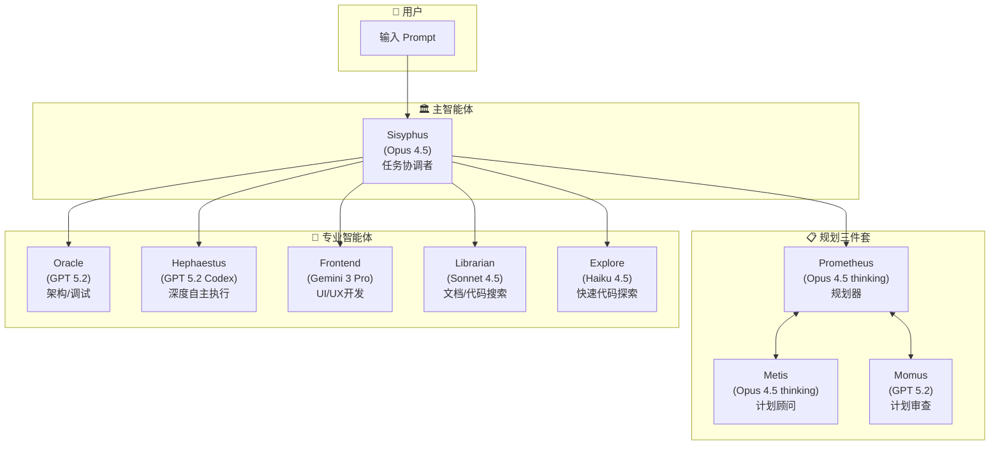

# OpenCode 介绍与实战

面向软件算法岗位的技术培训

<div class="pt-12">
  <span @click="$slidev.nav.next" class="px-2 py-1 rounded cursor-pointer" hover="bg-white bg-opacity-10">
    按空格键继续 <carbon:arrow-right class="inline"/>
  </span>
</div>

<div class="abs-br m-6 flex gap-2">
  <a href="https://github.com/opencode-ai/opencode" target="_blank" alt="GitHub" title="Open in GitHub"
    class="text-xl slidev-icon-btn opacity-50 !border-none !hover:text-white">
    <carbon-logo-github />
  </a>
</div>

<!--
欢迎大家参加本次培训，今天我们将深入了解 OpenCode 这个强大的 AI 编程助手工具。
-->

---
layout: section
---

# 第一部分

## 为什么需要使用 OpenCode？

---
layout: quote
---

# "不可能把未来押给一家随时可能封号的公司"

---

# Claude Code 的问题

<v-clicks>

- **封禁风险**：存在封禁中国用户的问题
- **排斥竞争**：切断第三方调用权限、封禁 OpenCode 等竞争工具用户
- **模型绑定**：与 Claude 模型强绑定，无法稳定使用其他 AI 模型（GPT、Gemini 等）
- **服务不稳定**：账号随时可能被封禁，影响工作连续性

</v-clicks>

<div v-click class="mt-8 p-4 bg-red-500/10 border border-red-500/30 rounded-lg">
  <strong>核心痛点：</strong>作为开发者，我们需要一个稳定、可靠、不受单一厂商限制的工具
</div>

<!--
这些问题在实际工作中会造成很大的困扰，尤其是当你的工作流程已经依赖这些工具时。
-->

---
layout: two-cols
---

# OpenCode 的优势

<v-clicks>

### 开源且支持多模型
- 可接入 **75+** 个 LLM 提供商
- 支持 GPT、Gemini、Claude、国产模型等
- 支持本地模型部署
- 无需翻墙即可安装使用

### 中国用户友好
- 无使用障碍
- 华人创始人
- 飞书话题社区技术支持
- 无封号风险

</v-clicks>

::right::

<v-clicks>

### 高可定制性
- 类似 Android 系统的开放性
- 支持深度定制
- Oh My OpenCode 插件生态
- 多智能体并行协作

### 社区活跃
- 开源透明
- 快速迭代
- 丰富的插件生态

</v-clicks>

<style>
h3 {
  color: #4ade80;
  margin-top: 1rem;
}
</style>

---
layout: center
class: text-center
---

# OpenCode vs Claude Code

<div class="grid grid-cols-2 gap-8 mt-8">

<div class="p-6 bg-green-500/10 border border-green-500/30 rounded-lg">

### OpenCode

<div class="text-5xl font-bold text-green-400 my-4">95.2k</div>

Stars on GitHub

<div class="text-2xl text-gray-400 mt-2">8.9k Forks</div>

</div>

<div class="p-6 bg-gray-500/10 border border-gray-500/30 rounded-lg">

### Claude Code

<div class="text-5xl font-bold text-gray-400 my-4">63.2k</div>

Stars on GitHub

<div class="text-2xl text-gray-400 mt-2">4.8k Forks</div>

</div>

</div>

<div class="mt-6 text-sm text-gray-500">截止 2025年2月</div>

---

# OpenCode vs Cursor 等 AI IDE

<div class="grid grid-cols-2 gap-6 mt-6">

<div v-click class="p-4 bg-blue-500/10 border border-blue-500/30 rounded-lg">

### Cursor 模式

- 围绕 IDE 运行
- AI 是"高级助手"
- 需关注代码逻辑、项目结构
- **你在写代码**

</div>

<div v-click class="p-4 bg-green-500/10 border border-green-500/30 rounded-lg">

### OpenCode 模式

- 以 AI Agent 为核心
- 只需描述目标和要求
- 专注需求、流程、结果检查
- **AI 在写代码**

</div>

</div>

<div v-click class="mt-8 text-center">

<div class="text-xl">
  角色转变：从 <span class="text-blue-400">借助 AI 写代码</span> → <span class="text-green-400">指挥 AI 工程师完成产品</span>
</div>

</div>

<v-click>

<div class="mt-4 p-3 bg-yellow-500/10 border border-yellow-500/30 rounded text-sm">
  💡 CLI Coding Agent 才是核心，IDE 只是 UI 界面的一种形式
</div>

</v-click>

---
layout: section
---

# 第二部分

## OpenCode 模型配置方案

---

# 模型推荐方案

<div class="grid grid-cols-2 gap-6 mt-4">

<div v-click>

### 任务类型 → 推荐模型

| 任务类型 | 推荐模型                       |
| -------- | ------------------------------ |
| 规划     | Claude Opus 4.5 ≈ GPT5.2       |
| 编程     | Claude Opus 4.5 > GPT5.2-Codex |
| 前端设计 | Gemini 3 Pro                   |
| 代码审查 | GPT5.2-Codex                   |
| 多模态   | Gemini 3 Pro                   |
| 简单任务 | MiniMax M2.1 / GLM 4.7         |

</div>

<div v-click>

### 核心原则

- **规划任务**用最强模型
- **编程任务**注重代码质量
- **简单任务**用性价比高的模型
- 根据实际效果动态调整

</div>

</div>

<style>
table {
  font-size: 0.9rem;
}
th {
  background-color: rgba(74, 222, 128, 0.1);
}
</style>

---

# 推荐的订阅方案

<div class="grid grid-cols-3 gap-4 mt-6">

<div v-click class="p-4 bg-purple-500/10 border border-purple-500/30 rounded-lg">

### GitHub Copilot

<div class="text-sm mt-2 text-gray-400">

- 与 OpenCode 深度集成
- 支持多种模型切换
- 订阅价格合理

</div>

</div>

<div v-click class="p-4 bg-green-500/10 border border-green-500/30 rounded-lg">

### ChatGPT Plus

<div class="text-sm mt-2 text-gray-400">

- GPT 系列模型
- 稳定可靠
- 适合日常使用

</div>

</div>

<div v-click class="p-4 bg-blue-500/10 border border-blue-500/30 rounded-lg">

### 国内大模型套餐

<div class="text-sm mt-2 text-gray-400">

- 智谱 Coding Plan
- Minimax Coding Plan
- Kimi Code Plan

 </div>

</div>

</div>

---

# 不推荐的方案

<div class="grid grid-cols-2 gap-6 mt-6">

<div v-click="1" class="p-4 bg-red-500/10 border border-red-500/30 rounded-lg">

### ❌ CC-Switch 方案

**风险点：**

- 只能通过 API key 调用
- 无法使用订阅套餐
- 调用频率控制不当成本极高
- 平台政策风险大
- 可能导致接口收紧或封禁

</div>

<div v-click="2" class="p-4 bg-red-500/10 border border-red-500/30 rounded-lg">

### ❌ API 计费方案

**风险点：**

- 302.ai、OpenRouter 等第三方平台
- 对编程深度用户成本过高
- 无法享受订阅优惠
- 费用难以控制

</div>

</div>

<div v-click="3" class="mt-6 p-3 bg-yellow-500/10 border border-yellow-500/30 rounded text-sm text-center">
  ⚠️ 不推荐普通用户尝试上述方案
</div>

---
layout: section
---

# 第三部分

## OpenCode 实战

---

# 工作流建议

<div class="grid grid-cols-2 gap-4 mt-2">

<div v-click class="text-sm">

### 推荐工作流

1. **需求分析** - 明确目标，拆解小任务
2. **任务规划** - 强模型做整体规划
3. **并行开发** - 多会话处理不同模块
4. **检查验收** - 代码审查、功能测试

</div>

<div v-click class="text-sm">

### 最佳实践

- 给 AI 足够的上下文
- 描述清晰的目标
- 分步骤执行复杂任务
- 及时检查中间结果
- 使用 git 做版本控制

</div>

</div>

<div v-click class="mt-4 p-3 bg-blue-500/10 border border-blue-500/30 rounded-lg text-sm">
  💡 <strong>核心原则</strong>：从"写代码"转变为"指挥 AI"，专注于需求理解、架构设计和结果验收
</div>

<style>
h3 {
  font-size: 1rem;
  margin-bottom: 0.5rem;
}
</style>

---

# Oh My OpenCode 插件

<div class="grid grid-cols-2 gap-4 mt-2">

<div v-click class="text-sm">

### 核心能力

- **Sisyphus 主智能体**：协调整体任务执行
- **多智能体协调**：Oracle、Librarian、Explore 等专业 Agent 并行工作
- **最佳实践集成**：内置专业的开发规范和流程
- **效率提升**：Todo 强制继续、自动代码审查等

</div>

<div v-click class="text-sm">

### 安装使用

```bash
# 推荐：让 AI Agent 执行安装
# 将以下 URL 发送给 Claude Code / OpenCode：
https://raw.githubusercontent.com/code-yeongyu/
oh-my-opencode/refs/heads/master/docs/guide/
installation.md

# 或使用 npx 交互式安装
npx oh-my-opencode@latest install
```

</div>

</div>

---

# Oh My OpenCode 多智能体架构

<div class="flex justify-center mt-2">



</div>

<div class="text-xs text-gray-400 text-center mt-1">
  💡 使用 <code>ultrawork</code> 或 <code>ulw</code> 关键词激活完整多智能体协作
</div>

---

# 其他推荐插件/工具


<div class="grid grid-cols-2 gap-4 mt-4">

<div v-click class="p-3 bg-gray-500/10 rounded">

### find-skills
查找和管理 skills

</div>

<div v-click class="p-3 bg-gray-500/10 rounded">

### opencode-antigravity-auth
认证和权限管理

</div>

<div v-click class="p-3 bg-gray-500/10 rounded">

### obra/superpowers
增强能力集合

</div>

<div v-click class="p-3 bg-gray-500/10 rounded">

### ralph-loop
自动化循环执行任务

</div>

 </div>

<div class="mt-6">

### MCP 服务推荐

<v-clicks>

- **Playwright MCP**：浏览器自动化
- **Git MCP**：Git 操作增强
- **Context7**：文档查询服务

</v-clicks>

</div>

---

# 常用操作快捷键

<div class="mt-4">

| 快捷键          | 功能说明                                                  |
| --------------- | --------------------------------------------------------- |
| `Ctrl + X, L`   | 切换会话（多会话处理，如同时开发前后端）                  |
| `Ctrl + T`      | 切换模型 Variant（Thinking 模式、GPT 的 low/medium/high） |
| `Ctrl + X, M`   | 切换模型                                                  |
| `Ctrl + P`      | 打开命令面板                                              |
| `Ctrl + X, ←/→` | 查看 Subagent                                             |
| `Ctrl + Enter`  | 换行输入                                                  |

</div>

<div v-click class="mt-6 p-4 bg-blue-500/10 border border-blue-500/30 rounded-lg">

### 💡 小技巧

多会话处理是一个强大的功能，可以让你在一个窗口写前端代码，另一个窗口写后端代码，大幅提升开发效率。

</div>

<style>
table {
  font-size: 0.85rem;
}
th {
  background-color: rgba(59, 130, 246, 0.1);
}
td:first-child {
  font-family: 'Fira Code', monospace;
  color: #60a5fa;
}
</style>

---
layout: section
---

# 第四部分

## 实战演示

---
layout: center
---

# Demo Time

<div class="text-xl text-gray-400 mt-4">
  现场演示 OpenCode 的实际使用
</div>

<div class="mt-8 grid grid-cols-2 gap-4 text-sm">

<div v-click class="p-4 bg-gray-500/10 rounded">

### Demo 1: 基础对话
- 启动 OpenCode
- 基本命令操作
- 模型切换

</div>

<div v-click class="p-4 bg-gray-500/10 rounded">

### Demo 2: 代码生成
- 描述需求
- 生成代码
- 迭代优化

</div>

<div v-click class="p-4 bg-gray-500/10 rounded">

### Demo 3: 多会话
- 创建多个会话
- 并行开发
- 会话切换

</div>

<div v-click class="p-4 bg-gray-500/10 rounded">

### Demo 4: 插件使用
- 安装插件
- 配置和使用
- 效果对比

</div>

</div>

---
layout: section
---

# 结语

---
layout: two-cols
---

# 为什么选择 OpenCode

<v-clicks>

### 风险规避
- 闭源平台存在封号、服务中断等风险
- 开源工具更适合长期使用

### 趋势把握
- AI 发展明确走向智能体协助
- 自动执行任务将成为主流

### 效率提升
- 从"写代码"到"指挥 AI"
- 专注于创造性工作

</v-clicks>

::right::

<div v-click class="ml-4">

### AI 编程的未来

<div class="p-4 bg-gradient-to-r from-green-500/10 to-blue-500/10 rounded-lg mt-4">

以对话和调度为核心的工具将越来越主流

<div class="mt-4 text-sm text-gray-400">
  典型案例：Clawdbot（Mac 后台智能体，通过即时通讯沟通）
</div>

</div>

<div class="mt-6 p-4 bg-yellow-500/10 border border-yellow-500/30 rounded-lg text-sm">

💡 **建议**：尽早熟悉和掌握这类工具，建立新的工作范式

</div>

</div>

---
layout: center
class: text-center
---

# 谢谢大家！

<div class="text-xl text-gray-400 mt-4">
  欢迎提问和交流
</div>

<div class="mt-12 grid grid-cols-3 gap-8 text-sm">

<div>
  <div class="text-gray-500 mb-2">GitHub</div>
  <a href="https://github.com/opencode-ai/opencode" target="_blank" class="text-blue-400">
    opencode-ai/opencode
  </a>
</div>

<div>
  <div class="text-gray-500 mb-2">文档</div>
  <a href="https://docs.opencode.ai" target="_blank" class="text-blue-400">
    docs.opencode.ai
  </a>
</div>

<div>
  <div class="text-gray-500 mb-2">社区</div>
  <span class="text-blue-400">
    飞书话题社区
  </span>
</div>

</div>

<div class="abs-br m-6">
  <carbon-logo-github class="text-2xl opacity-50" />
</div>

---
layout: end
---

# 培训结束

感谢参与！
