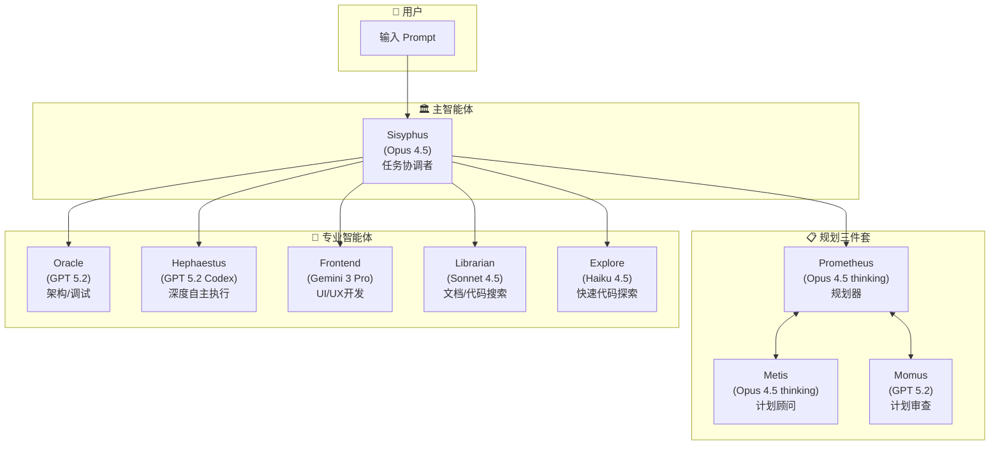
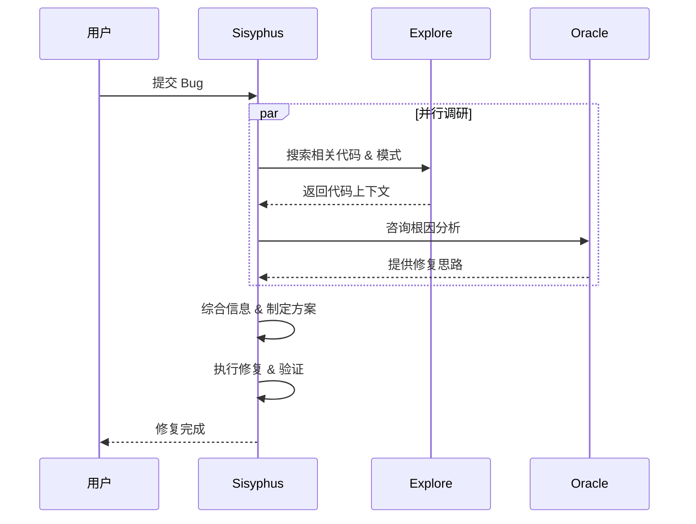
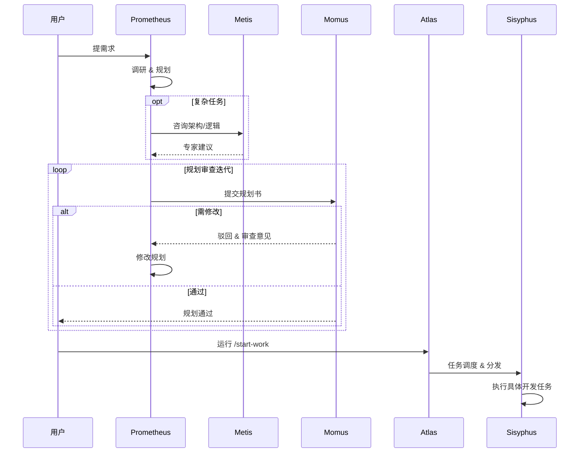

# OpenCode 介绍与实战

面向软件算法岗位的技术培训

<div class="pt-12">
  <span @click="$slidev.nav.next" class="px-2 py-1 rounded cursor-pointer" hover="bg-white bg-opacity-10">
    按空格键继续 <carbon:arrow-right class="inline"/>
  </span>
</div>

<div class="abs-br m-6 flex gap-2">
  <a href="https://github.com/opencode-ai/opencode" target="_blank" alt="GitHub" title="Open in GitHub"
    class="text-xl slidev-icon-btn opacity-50 !border-none !hover:text-white">
    <carbon-logo-github />
  </a>
</div>

<!--
 欢迎大家参加本次培训，今天我们将深入了解 OpenCode 这个强大的 AI 编程助手工具。
 -->

---
layout: center
class: text-center
---

# 议程

<v-clicks>

<div class="agenda-item">
  <div class="agenda-part">第一部分</div>
  <div class="agenda-title">为什么需要使用 OpenCode？</div>
</div>

<div class="agenda-item">
  <div class="agenda-part">第二部分</div>
  <div class="agenda-title">OpenCode 模型配置方案</div>
</div>

<div class="agenda-item">
  <div class="agenda-part">第三部分</div>
  <div class="agenda-title">OpenCode 实战</div>
</div>

</v-clicks>

<style>
.agenda-item {
  margin-bottom: 2rem;
}
.agenda-part {
  font-size: 1rem;
  color: #4ade80;
  font-weight: 500;
  margin-bottom: 0.6rem;
}
.agenda-title {
  font-size: 1.5rem;
  font-weight: 700;
}
</style>

---
layout: section
transition: fade
---

<div v-motion :initial="{scale:0.5,opacity:0}" :enter="{scale:1,opacity:1}">
  <carbon:warning-alt class="text-8xl text-orange-400 mb-4" />
</div>

# 第一部分

## 为什么需要使用 OpenCode？

---
layout: quote
transition: fade
---

# "不可能把未来押给一家随时可能封号的公司"

---

# Claude Code 的问题

<div class="grid grid-cols-2 gap-6 mt-8">

<div v-click class="p-4 bg-red-500/10 border border-red-500/30 rounded-lg">
  <div class="flex items-center gap-2 mb-2">
    <carbon:warning-alt class="text-red-400 text-xl"/>
    <div class="font-bold text-red-400">封禁风险</div>
  </div>
  <div class="text-sm text-gray-400">
    存在封禁中国用户的问题，账号安全无法保障
  </div>
</div>

<div v-click class="p-4 bg-orange-500/10 border border-orange-500/30 rounded-lg">
  <div class="flex items-center gap-2 mb-2">
    <carbon:locked class="text-orange-400 text-xl"/>
    <div class="font-bold text-orange-400">排斥竞争</div>
  </div>
  <div class="text-sm text-gray-400">
    切断第三方调用权限、封禁 OpenCode 等竞争工具用户
  </div>
</div>

<div v-click class="p-4 bg-yellow-500/10 border border-yellow-500/30 rounded-lg">
  <div class="flex items-center gap-2 mb-2">
    <carbon:connection-signal-off class="text-yellow-400 text-xl"/>
    <div class="font-bold text-yellow-400">模型绑定</div>
  </div>
  <div class="text-sm text-gray-400">
    强绑定 Claude 模型，无法使用 GPT、Gemini 等其他模型
  </div>
</div>

<div v-click class="p-4 bg-gray-500/10 border border-gray-500/30 rounded-lg">
  <div class="flex items-center gap-2 mb-2">
    <carbon:activity class="text-gray-400 text-xl"/>
    <div class="font-bold text-gray-400">服务不稳定</div>
  </div>
  <div class="text-sm text-gray-400">
    账号随时可能被封禁，严重影响工作流连续性
  </div>
</div>

</div>

<div v-click class="mt-8 p-4 bg-gradient-to-r from-red-500/10 to-orange-500/10 border border-red-500/30 rounded-lg text-center">
  <strong>核心痛点</strong>：作为开发者，我们需要一个<span class="text-red-400 font-bold">稳定、可靠、不受单一厂商限制</span>的工具
</div>

<!--
这些问题在实际工作中会造成很大的困扰，尤其是当你的工作流程已经依赖这些工具时。
-->

---
layout: two-cols
---

# OpenCode 的优势

<v-clicks>

### 开源且支持多模型
- 可接入 **<span v-mark.highlight="{color:'#4ade80'}">75+</span>** 个 LLM 提供商
- 支持 GPT、Gemini、Claude、国产模型等
- 支持本地模型部署
- 无需翻墙即可安装使用
- 提供许多免费模型，降低上手门槛


### 中国用户友好
- 无使用障碍
- 华人创始人
- 飞书话题社区技术支持
- 无封号风险

</v-clicks>

::right::

<v-clicks>

### 高可定制性
- 类似 Android 系统的开放性
- 支持深度定制
- Oh My OpenCode 插件生态
- 多智能体并行协作

### 交互体验优越
- **Prompt Queue**：Agent 工作时可随时插入新指令
- 无需等待当前任务完成即可打断/补充
- Copilot 等工具目前不支持此功能

### 社区活跃
- 开源透明
- 快速迭代
- 丰富的插件生态

</v-clicks>

<style>
h3 {
  color: #4ade80;
  margin-top: 1rem;
}
</style>

---
layout: center
class: text-center
transition: slide-up
---

# OpenCode vs Claude Code

<div class="grid grid-cols-2 gap-8 mt-8">

<div class="p-6 bg-green-500/10 border border-green-500/30 rounded-lg">

### OpenCode
<div class="text-xs text-green-400/70 -mt-1 mb-2">首版发布 2025.06 · 后起之秀</div>

<div class="text-5xl font-bold text-green-400 my-4"><span v-mark.circle="1">95.2k</span></div>

Stars on GitHub

<div class="text-2xl text-gray-400 mt-2">8.9k Forks</div>

</div>

<div class="p-6 bg-gray-500/10 border border-gray-500/30 rounded-lg">

### Claude Code
<div class="text-xs text-gray-500 -mt-1 mb-2">首版发布 2025.02</div>

<div class="text-5xl font-bold text-gray-400 my-4"><span v-mark.circle="2">63.2k</span></div>

Stars on GitHub

<div class="text-2xl text-gray-400 mt-2">4.8k Forks</div>

</div>

</div>

<div class="mt-6 text-sm text-gray-500">截止 2025年2月</div>

---
transition: slide-up
---

# OpenCode vs Cursor 等 AI IDE

<div class="grid grid-cols-2 gap-4 mt-4">

<div v-click class="p-3 bg-blue-500/10 border border-blue-500/30 rounded-lg text-sm">

### Cursor 模式

- 围绕 IDE 运行，AI 是"高级助手"
- 需关注代码逻辑、项目结构
- **你在写代码**

</div>

<div v-click class="p-3 bg-green-500/10 border border-green-500/30 rounded-lg text-sm">

### OpenCode 模式

- 以 AI Agent 为核心
- 只需描述目标和要求
- **AI 在写代码**

</div>

</div>

<div v-click class="mt-4 p-3 bg-purple-500/10 border border-purple-500/30 rounded-lg">

### 🔧 底层架构差异

<div class="grid grid-cols-2 gap-4 mt-2 text-sm">

<div>

**Cursor (依托 VSCode/IDE)**
- 受 Extension API 沙箱限制
- 文件/终端操作需通过 API 边界
- Electron 框架额外内存开销
- 扩展受限于 IDE 插件体系

</div>

<div>

**OpenCode (依托操作系统)**
- 直接调用 `grep`/`git`/`ast-grep` 等原生工具
- 无沙箱限制，可启动任意进程
- 零中间层，工具调用延迟极低
- MCP 协议自由扩展任意 CLI 工具

</div>

</div>

</div>

<div v-click class="mt-3 p-2 bg-yellow-500/10 border border-yellow-500/30 rounded text-sm text-center">
  💡 CLI Agent 直接对话操作系统，IDE Agent 需要通过 IDE 这个"中间人"
</div>

---
layout: section
transition: fade
---

<div v-motion :initial="{scale:0.5,opacity:0}" :enter="{scale:1,opacity:1}">
  <carbon:settings class="text-8xl text-blue-400 mb-4" />
</div>

# 第二部分

## OpenCode 模型配置方案

---

# 模型推荐方案

<div class="grid grid-cols-2 gap-6 mt-4">

<div v-click>

### 任务类型 → 推荐模型

| 任务类型 | 推荐模型                       |
| -------- | ------------------------------ |
| 规划     | Claude Opus 4.5 ≈ GPT5.2       |
| 编程     | Claude Opus 4.5 > GPT5.2-Codex |
| 前端设计 | Gemini 3 Pro                   |
| 代码审查 | GPT5.2-Codex                   |
| 多模态   | Gemini 3 Pro                   |
| 简单任务 | MiniMax M2.1 / GLM 4.7         |

</div>

<div v-click>

### 核心原则

- **规划任务**用最强模型
- **编程任务**注重代码质量
- **简单任务**用性价比高的模型
- 根据实际效果动态调整

</div>

</div>

<div v-click class="mt-4 p-3 bg-yellow-500/10 border border-yellow-500/30 rounded-lg text-sm">
  ⚠️ <strong>注意</strong>：没有永恒的 SOTA，模型迭代速度极快。国产模型正在快速追赶，建议持续关注最新动态，根据实际效果灵活调整。
</div>

<style>
table {
  font-size: 0.9rem;
}
th {
  background-color: rgba(74, 222, 128, 0.1);
}
</style>

---

# 推荐的订阅方案

<div class="grid grid-cols-2 gap-3 mt-4">

<div v-click class="p-3 bg-purple-500/10 border border-purple-500/30 rounded-lg">

### GitHub Copilot <span class="text-xs text-purple-400">~$10-39/月</span>

<div class="text-sm mt-2 text-gray-400">

- 与 OpenCode 深度集成
- 支持 GPT-4o、Claude Sonnet、Gemini 等
- 性价比最高的多模型方案

</div>

</div>

<div v-click class="p-3 bg-green-500/10 border border-green-500/30 rounded-lg">

### ChatGPT Plus <span class="text-xs text-green-400">~$20/月</span>

<div class="text-sm mt-2 text-gray-400">

- GPT 系列模型完整访问
- o1/o3 推理模型
- 稳定可靠，适合日常使用

</div>

</div>

<div v-click class="p-3 bg-orange-500/10 border border-orange-500/30 rounded-lg">

### Claude Max/Pro <span class="text-xs text-orange-400">~$20-100/月</span>

<div class="text-sm mt-2 text-gray-400">

- 编程能力最强的模型之一
- ⚠️ 需要稳定的订阅渠道
- 有封号风险，谨慎评估

</div>

</div>

<div v-click class="p-3 bg-blue-500/10 border border-blue-500/30 rounded-lg">

### 国内大模型套餐 <span class="text-xs text-blue-400">价格友好</span>

<div class="text-sm mt-2 text-gray-400">

- 智谱/Minimax/Kimi Coding Plan
- 部分支持 API 形式使用订阅额度
- 无需翻墙，稳定可靠

</div>

</div>

</div>

<div v-click class="mt-3 p-2 bg-yellow-500/10 border border-yellow-500/30 rounded text-xs">
  💡 <strong>推荐组合</strong>：GitHub Copilot（主力多模型） + 国产套餐（备用/简单任务） = 高性价比方案
</div>

---
layout: center
class: text-center
---

# 不推荐的方案

<div class="text-sm text-gray-400 mb-2">以下是一些用户可能考虑的替代方案，但存在明显缺陷</div>

<div class="grid grid-cols-3 gap-4">

<div v-click="1" class="p-3 bg-red-500/10 border border-red-500/30 rounded-lg text-sm">

### ❌ Claude Code + CC-Switch

<div class="text-xs text-gray-500 mb-2">让 Claude Code 调用其他模型</div>

- 依赖 Claude Code 官方客户端
- 本质是"套壳"，受上游政策约束
- Anthropic 曾封禁此类用法
- 随时可能失效

<div class="text-xs text-green-400 mt-2">💡 OpenCode 原生支持多模型</div>

</div>

<div v-click="2" class="p-3 bg-red-500/10 border border-red-500/30 rounded-lg text-sm">

### ❌ API 按量计费

<div class="text-xs text-gray-500 mb-2">302.ai、OpenRouter 等平台</div>

- 对编程深度用户成本过高
- 无法享受订阅优惠
- 费用难以控制
- 重度使用月费可达数百美元

</div>

<div v-click="3" class="p-3 bg-orange-500/10 border border-orange-500/30 rounded-lg text-sm">

### ⚠️ Google AI Studio

<div class="text-xs text-gray-500 mb-2">通过 antigravity-auth 等方式接入</div>

- Gemini 免费额度确实很高
- 但非官方支持的接入方式
- 存在封号风险
- 稳定性无法保证

</div>

</div>

<div v-click="4" class="mt-4 p-2 bg-yellow-500/10 border border-yellow-500/30 rounded text-xs text-center">
  ⚠️ 以上方案或成本过高，或存在政策风险，不推荐普通用户尝试
</div>

<div class="mt-8 flex justify-around text-sm text-gray-400">
  <div class="flex flex-col items-center gap-2" v-click="5">
    <div class="w-12 h-12 rounded-full bg-red-500/10 border border-red-500/30 flex items-center justify-center transition hover:scale-110">
      <carbon:money class="text-red-400 text-2xl"/>
    </div>
    <span>成本不可控</span>
  </div>
  <div class="flex flex-col items-center gap-2" v-click="6">
    <div class="w-12 h-12 rounded-full bg-orange-500/10 border border-orange-500/30 flex items-center justify-center transition hover:scale-110">
      <carbon:warning-filled class="text-orange-400 text-2xl"/>
    </div>
    <span>封号风险高</span>
  </div>
  <div class="flex flex-col items-center gap-2" v-click="7">
    <div class="w-12 h-12 rounded-full bg-gray-500/10 border border-gray-500/30 flex items-center justify-center transition hover:scale-110">
      <carbon:network-4 class="text-gray-400 text-2xl"/>
    </div>
    <span>生态封闭</span>
  </div>
</div>

---
layout: section
transition: fade
---

<div v-motion :initial="{scale:0.5,opacity:0}" :enter="{scale:1,opacity:1}">
  <carbon:code class="text-8xl text-green-400 mb-4" />
</div>

# 第三部分

## OpenCode 实战

---

# 工作流建议

<div class="grid grid-cols-2 gap-4 mt-2">

<div v-click class="text-sm">

### 推荐工作流

<div class="mt-4 flex flex-col gap-2 text-xs font-mono text-gray-300 scale-90 origin-top-left">
  <div class="flex items-center gap-3 bg-green-500/10 p-2 rounded-md border-l-2 border-green-500">
    <div class="font-bold text-green-400 w-24">1. 需求</div>
    <div class="text-gray-400 flex-1">Prometheus 需求分析</div>
  </div>
  
  <div class="flex justify-center text-gray-600 -my-1">
    <carbon:arrow-down />
  </div>

  <div class="flex items-center gap-3 bg-blue-500/10 p-2 rounded-md border-l-2 border-blue-500">
    <div class="font-bold text-blue-400 w-24">2. 规划</div>
    <div class="text-gray-400 flex-1">Prometheus <-> Momus 审查</div>
  </div>

  <div class="flex justify-center text-gray-600 -my-1">
    <carbon:arrow-down />
  </div>

  <div class="flex items-center gap-3 bg-indigo-500/10 p-2 rounded-md border-l-2 border-indigo-500">
    <div class="font-bold text-indigo-400 w-24">3. 调度</div>
    <div class="text-gray-400 flex-1">Atlas 任务分发</div>
  </div>

  <div class="flex justify-center text-gray-600 -my-1">
    <carbon:arrow-down />
  </div>

  <div class="grid grid-cols-2 gap-2">
    <div class="bg-purple-500/10 p-2 rounded-md border-l-2 border-purple-500">
      <div class="font-bold text-purple-400 mb-1">Sisyphus A</div>
      <div class="text-[10px] text-gray-400">前端开发</div>
    </div>
    <div class="bg-purple-500/10 p-2 rounded-md border-l-2 border-purple-500">
      <div class="font-bold text-purple-400 mb-1">Sisyphus B</div>
      <div class="text-[10px] text-gray-400">后端开发</div>
    </div>
  </div>

  <div class="flex justify-center text-gray-600 -my-1">
    <carbon:arrow-down />
  </div>

  <div class="flex items-center gap-3 bg-orange-500/10 p-2 rounded-md border-l-2 border-orange-500">
    <div class="font-bold text-orange-400 w-24">5. 交付</div>
    <div class="text-gray-400 flex-1">Momus 最终验收</div>
  </div>
</div>

</div>

<div v-click class="text-sm">

### 最佳实践

- **上下文管理**：给 AI 足够的上下文，但不要过多干扰
- **目标清晰**：描述清晰的目标，避免模糊指令
- **步骤化**：分步骤执行复杂任务，"Step by step"
- **及时反馈**：及时检查中间结果，纠正偏差
- **版本控制**：使用 git 做版本控制，随时回滚

</div>

</div>

<div v-click class="mt-4 p-3 bg-blue-500/10 border border-blue-500/30 rounded-lg text-sm">
  💡 <strong>核心原则</strong>：从"写代码"转变为"指挥 AI"，专注于需求理解、架构设计和结果验收
</div>

<style>
h3 {
  font-size: 1rem;
  margin-bottom: 0.5rem;
}
</style>

---

# Oh My OpenCode 插件

<div class="grid grid-cols-2 gap-4 mt-2">

<div v-click class="text-sm">

### 核心能力

- **Sisyphus 主智能体**：协调整体任务执行
- **多智能体协调**：Oracle、Librarian、Explore 等专业 Agent 并行工作
- **最佳实践集成**：内置专业的开发规范和流程
- **效率提升**：Todo 强制继续、自动代码审查等

</div>

<div v-click class="text-sm">

### 安装使用

```bash
# 推荐：让 AI Agent 执行安装
# 将以下 URL 发送给 Claude Code / OpenCode：
https://raw.githubusercontent.com/code-yeongyu/
oh-my-opencode/refs/heads/master/docs/guide/
installation.md

# 或使用 npx 交互式安装
npx oh-my-opencode@latest install
```

</div>

</div>

<div v-click class="mt-6 bg-[#1e1e1e] p-4 rounded-lg border border-gray-700 font-mono text-xs shadow-xl">
  <div class="flex gap-1.5 mb-3 border-b border-gray-700 pb-2">
    <div class="w-2.5 h-2.5 rounded-full bg-red-500"></div>
    <div class="w-2.5 h-2.5 rounded-full bg-yellow-500"></div>
    <div class="w-2.5 h-2.5 rounded-full bg-green-500"></div>
    <div class="text-gray-500 ml-2">zsh — 80x24</div>
  </div>
  <div class="text-green-400 font-bold">$ npx oh-my-opencode install</div>
  <div class="text-gray-300 mt-1">Downloading core components... <span class="text-green-500">[100%]</span></div>
  <div class="text-gray-300">✔ Sisyphus Agent installed</div>
  <div class="text-gray-300">✔ Skill: git-master installed</div>
  <div class="text-gray-300">✔ Skill: playwright installed</div>
  <div class="text-gray-300">✔ Skill: verification-before-completion installed</div>
  <div class="text-blue-400 mt-2">✨ Ready to work! Type 'ultrawork' to start.</div>
</div>

---

# Oh My OpenCode 多智能体架构

<div class="flex justify-center mt-2">



</div>

<div class="text-xs text-gray-400 text-center mt-1">
  💡 使用 <code>ultrawork</code> 或 <code>ulw</code> 关键词激活完整多智能体协作
</div>

---

# 多智能体架构的核心优势

<div class="grid grid-cols-2 gap-4 mt-4">

<div v-click class="p-3 bg-green-500/10 border border-green-500/30 rounded-lg text-sm">

### 🎯 模型各取所长

不同模型擅长不同任务：
- **Claude Opus** → 复杂规划、整体协调
- **GPT 5.2 Codex** → 深度调试、架构设计
- **Gemini 3 Pro** → 前端 UI/UX、视觉设计
- **Haiku 4.5** → 快速探索、简单任务

</div>

<div v-click class="p-3 bg-blue-500/10 border border-blue-500/30 rounded-lg text-sm">

### 🧠 上下文保持整洁

主 Agent 委派低级任务给 Subagent：
- 探索代码 → Explore Agent
- 查阅文档 → Librarian Agent
- **主 Agent 专注整体任务编排**
- **节省 70%+ Token 消耗**

</div>

<div v-click class="p-3 bg-purple-500/10 border border-purple-500/30 rounded-lg text-sm">

### ⚡ 并行处理加速

多个 Agent 同时工作：
- 前端后端并行开发
- 代码搜索与文档查阅同步
- **构建速度提升 2.5x**
- 后台任务不阻塞主流程

</div>

<div v-click class="p-3 bg-yellow-500/10 border border-yellow-500/30 rounded-lg text-sm">

### 💰 成本智能优化

分级调用策略：
- **FREE**: grep、LSP、AST 工具优先
- **CHEAP**: Explore、Librarian 高频使用
- **EXPENSIVE**: Oracle 仅复杂问题调用
- 自动选择性价比最优模型

</div>

</div>

---

# 多智能体协作示例

<div class="grid grid-cols-2 gap-6 mt-4">

<div v-click class="text-sm">

### 🐛 Bug 修复场景



</div>

<div v-click class="text-sm">

### 🚀 新功能开发场景



</div>

</div>

<div v-click class="mt-0 p-3 bg-gray-500/10 rounded-lg text-sm text-center">
  <strong>核心理念</strong>：你不再是独自编码，而是在<span class="text-green-400">管理一支 AI 开发团队</span>
</div>

---

# Skills 生态：扩展 OpenCode 能力

<div class="text-sm text-gray-400 mb-3">通过 Skills 可以快速为 Agent 注入领域专业知识</div>

<div class="grid grid-cols-2 gap-3">

<div v-click class="p-2 bg-purple-500/10 border border-purple-500/30 rounded text-sm">

### <carbon-flash class="inline text-purple-400"/> obra/superpowers
多智能体协作增强包（Oh My OpenCode 使用）

```bash {lines:false}
npx skills add obra/superpowers
```

</div>

<div v-click class="p-2 bg-blue-500/10 border border-blue-500/30 rounded text-sm">

### <carbon-document class="inline text-blue-400"/> anthropics/claude-plugins-official
官方插件集：PDF/PPTX/XLSX 处理等

```bash {lines:false}
npx skills add anthropics/claude-plugins-official
```

</div>

<div v-click class="p-2 bg-orange-500/10 border border-orange-500/30 rounded text-sm">

### <carbon-star class="inline text-orange-400"/> ComposioHQ/awesome-claude-skills
社区精选 skills 合集

```bash {lines:false}
npx skills add ComposioHQ/awesome-claude-skills
```

</div>

<div v-click class="p-2 bg-green-500/10 border border-green-500/30 rounded text-sm">

### <carbon-terminal class="inline text-green-400"/> vercel-labs/agent-skills
React/Next.js 最佳实践、组件模式

```bash {lines:false}
npx skills add vercel-labs/agent-skills
```

</div>

</div>

<div v-click class="mt-3 p-2 bg-gray-500/10 rounded text-xs text-center">
  💡 使用 <code>/find-skills</code> 命令让 Agent 帮你搜索和安装所需 skill
</div>

---

# MCP 服务与实用工具

<div class="grid grid-cols-2 gap-4 mt-4">

<div>

### <carbon-plug class="inline text-cyan-400"/> MCP 服务推荐

<v-clicks>

<div class="p-2 bg-cyan-500/10 border border-cyan-500/30 rounded text-sm mt-2">

**Playwright MCP** - 浏览器自动化测试、截图、表单填写

</div>

<div class="p-2 bg-cyan-500/10 border border-cyan-500/30 rounded text-sm mt-2">

**Context7** - 实时查询框架/库官方文档

</div>

<div class="p-2 bg-cyan-500/10 border border-cyan-500/30 rounded text-sm mt-2">

**GitHub MCP** - Issues、PR 管理、代码搜索

</div>

</v-clicks>

</div>

<div>

### <carbon-tool-box class="inline text-yellow-400"/> 其他实用工具

<v-clicks>

<div class="p-2 bg-yellow-500/10 border border-yellow-500/30 rounded text-sm mt-2">

**ralph-loop** - 自动化循环执行，直到任务完成

</div>

<div class="p-2 bg-yellow-500/10 border border-yellow-500/30 rounded text-sm mt-2">

**opencode-antigravity-auth** - Google AI Studio 认证

</div>

<div class="p-2 bg-yellow-500/10 border border-yellow-500/30 rounded text-sm mt-2">

**ultrawork 模式** - 完整多智能体协作关键词

</div>

</v-clicks>

</div>

</div>

<div v-click class="mt-4 p-3 bg-gray-500/10 rounded-lg text-sm">

### 📦 安装 MCP 示例

```bash {lines:false}
# 在 opencode 配置中添加 MCP
opencode mcp add playwright-mcp -- npx @anthropic/mcp-playwright
```

</div>

---

# 常用操作快捷键

<div class="mt-4">

| 快捷键          | 功能说明                                                        |
| --------------- | --------------------------------------------------------------- |
| `Ctrl + X, L`   | 切换会话（多会话处理，如同时开发前后端）                        |
| `Ctrl + T`      | 切换模型 Variant（Thinking 模式、GPT 的 low/medium/high/xhigh） |
| `Ctrl + X, M`   | 切换模型                                                        |
| `Ctrl + P`      | 打开命令面板                                                    |
| `Ctrl + X, ←/→` | 查看 Subagent                                                   |
| `Ctrl + Enter`  | 换行输入                                                        |

</div>

<div v-click class="mt-3 p-1 bg-blue-500/10 border border-blue-500/30 rounded-lg">

### 💡 小技巧

多会话处理是一个强大的功能，可以让你在一个窗口写前端代码，另一个窗口写后端代码，大幅提升开发效率。

</div>

<style>
table {
  font-size: 0.85rem;
}
th {
  background-color: rgba(59, 130, 246, 0.1);
}
td:first-child {
  font-family: 'Fira Code', monospace;
  color: #60a5fa;
}
</style>

---

# Demo Time
<div class="text-xl text-gray-400 mt-4">
  现场演示 OpenCode 的实际使用
</div>

<div class="mt-8 grid grid-cols-2 gap-4 text-sm">

<div v-click class="p-4 bg-gray-500/10 rounded">

### Demo 1: 基础对话
- 启动 OpenCode
- 基本命令操作
- 模型切换

</div>

<div v-click class="p-4 bg-gray-500/10 rounded">

### Demo 2: 代码生成
- 描述需求
- 生成代码
- 迭代优化

</div>

<div v-click class="p-4 bg-gray-500/10 rounded">

### Demo 3: 多会话
- 创建多个会话
- 并行开发
- 会话切换

</div>

<div v-click class="p-4 bg-gray-500/10 rounded">

### Demo 4: 插件使用
- 安装插件
- 配置和使用
- 效果对比

</div>

</div>

---
layout: section
transition: fade-out
---

# 结语

---
layout: two-cols
---

# 为什么选择 OpenCode

<v-clicks>

<div class="reason-item">
  <div class="reason-icon">🛡️</div>
  <div>
    <div class="reason-title">风险规避</div>
    <div class="reason-desc">闭源平台存在封号、服务中断等风险<br/>开源工具更适合长期使用</div>
  </div>
</div>

<div class="reason-item">
  <div class="reason-icon">📈</div>
  <div>
    <div class="reason-title">趋势把握</div>
    <div class="reason-desc">AI 发展明确走向智能体协助<br/>自动执行任务将成为主流</div>
  </div>
</div>

<div class="reason-item">
  <div class="reason-icon">⚡</div>
  <div>
    <div class="reason-title">效率提升</div>
    <div class="reason-desc">从"写代码"到"<span v-mark.underline>指挥 AI</span>"<br/>专注于创造性工作</div>
  </div>
</div>

</v-clicks>

<style>
.reason-item {
  display: flex;
  align-items: flex-start;
  gap: 1rem;
  margin-bottom: 1.25rem;
}
.reason-icon {
  font-size: 1.5rem;
  margin-top: 0.1rem;
}
.reason-title {
  color: #4ade80;
  font-weight: 600;
  font-size: 1.1rem;
  margin-bottom: 0.25rem;
}
.reason-desc {
  font-size: 0.9rem;
  color: #d1d5db;
  line-height: 1.5;
}
</style>

::right::

<div v-click class="ml-4">

### AI 编程的未来

<div class="p-4 bg-gradient-to-r from-green-500/10 to-blue-500/10 rounded-lg mt-4">

以对话和调度为核心的工具将越来越主流

<div class="mt-4 text-sm text-gray-400">
  典型案例：Clawdbot（Mac 后台智能体，通过即时通讯沟通）
</div>

</div>

<div class="mt-6 p-4 bg-yellow-500/10 border border-yellow-500/30 rounded-lg text-sm">

💡 **建议**：尽早熟悉和掌握这类工具，建立新的工作范式

</div>

</div>

---
layout: center
class: text-center
---

# 谢谢大家！

<div class="text-xl text-gray-400 mt-4">
  欢迎提问和交流
</div>

<div class="mt-12 grid grid-cols-3 gap-8 text-sm">

<div>
  <div class="text-gray-500 mb-2">GitHub</div>
  <a href="https://github.com/opencode-ai/opencode" target="_blank" class="text-blue-400">
    opencode-ai/opencode
  </a>
</div>

<div>
  <div class="text-gray-500 mb-2">文档</div>
  <a href="https://docs.opencode.ai" target="_blank" class="text-blue-400">
    docs.opencode.ai
  </a>
</div>

<div>
  <div class="text-gray-500 mb-2">社区</div>
  <span class="text-blue-400">
    飞书话题社区
  </span>
</div>

</div>

<div class="abs-br m-6">
  <carbon-logo-github class="text-2xl opacity-50" />
</div>

---
layout: end
---

# 培训结束

感谢参与！
